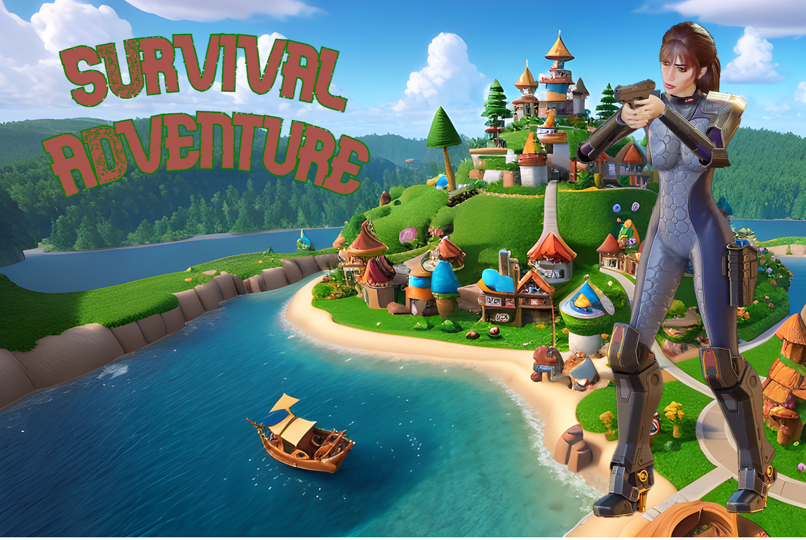
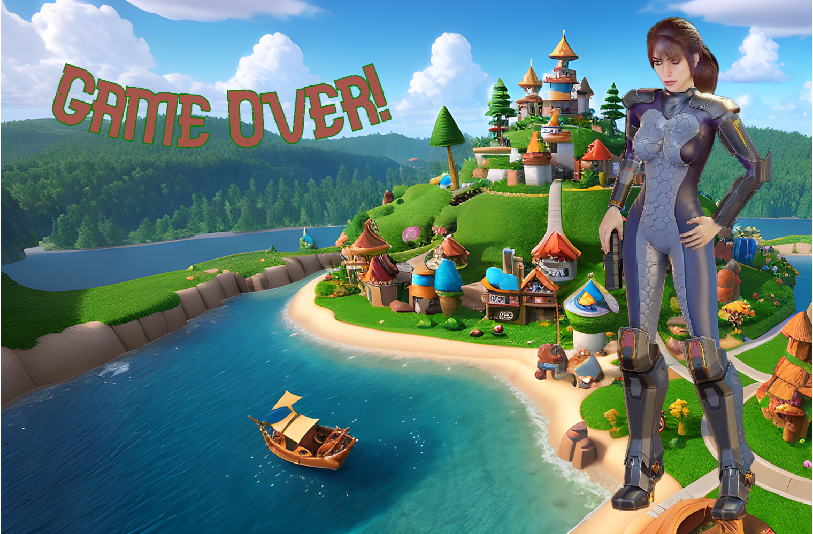

# Survival Adventure 3D 
## Avoid the Light

### Theme:
##### In a world flooded with relentless adversaries, you must navigate the perilous landscape of Survival Adventure. As a courageous explorer, you are surrounded by a haunting blue light that steadily drains your health. Dodge enemies, strategically manage your limited vitality, and strive to survive in this challenging adventure where the true enemy is not the darkness, but the encroaching radiance.

[Play Game](https://pranay7293.itch.io/survival-adventure)

### Key Features and Highlights
- Games' third-person perspective camera will act as an AIM camera in shoot mode.
- Player horizontal Rotation is synchronized with mouse horizontal input and the player can rotate 360 degrees.
- Player can move forward and backward in any direction as per rotation set by mouse input.
- Blue Light Zone will fall on the Player at random time intervals.
- Player has to move out of Blue Light Zone and
- Blue Light Zone is fixed to the player's initial position and doesn't follow the player.
- If the player reaches the Level completion point while enemies are alive, it will suggest killing all the enemies.
- On Level Completion, the Player will get Golden Cup. The Big Golden Cup turns small to fit in the Player's Hand. 

### Player Character
##### Basic Game Play Controls
- Will move forward and backward along with vertical input. ⬆️ ⬇️
- Will rotate along with horizontal mouse input. 🖱 
- On Mouse Right Click, the player will enter into shoot mode. Aim Crosshair will be enabled.
- With Mouse Left Click, the player can start shooting the enemies. But it works only in shoot mode.
- Will be in Idle when there is no input.

##### Health || Damage || Game Over
- Player health initially set to full (100).
- Will decrease by enemies attack. Different enemies will cause different ranges and random amounts of damage.
- Being in Blue Light Zone will reduce the player's health as well.
- Player has to avoid the  Blue Light Zone and Enemies attacks to avoid health loss.
- Player will lose the game on zero health and Game Over

##### Attack || Game Win
- Player will attack enemies with Pistol Gun.
- Bullets will be fired to shoot the enemies and cause damage to enemies.
- Bullets will cause different amounts of damage to different types of enemies.
- Player should kill all the enemies and reach the destination point to Win the Level.
- Destination point will show warning text to the player if there are any alive enemies left.

### Enemies
- Enemies will move on their own and keep patrolling in their range.
- If the player enters their range, they will chase after the player.
- Once the player is within the attack range they will start attacking and cause damage to the player.
- If the player moves out of their range, they will start patrolling in their range.
- Different types of enemies cause different amounts of random damage to the player.
- Enemies are all well positioned in the path to reach the level complete destination and they will keep patrolling in that path.

### Menu and UI options:
##### Lobby
- **Play:** To start the Game Play.
- **Music Icon:** Will enable and disable Background music.
- **Speaker Icon:** Will enable and disable Game Sounds.

##### Gameplay UI
- **Player Healthbar:** Indicates Player Health with a slider and numerically.
- **Enemies Alive:** Indicates Enemies Alive in the Game World.
- **Pause:** will affect gameplay to pause and the player will get options to Resume and Exit.
- **Resume:** will resume the gameplay from where it is Paused.
- **Exit:** will load the Lobby page.
- **On GameOver:** Player will get Reply and Exit options.
- **Reply:** Replay the game.
- **Exit:** will load the Lobby page.
- **On YouWin:** Player will get Reply and Exit options.
- **Reply:** Replay the game.
- **Exit:** will load the Lobby page.

## Lobby: 

## Player Win: 

## Game Over:

